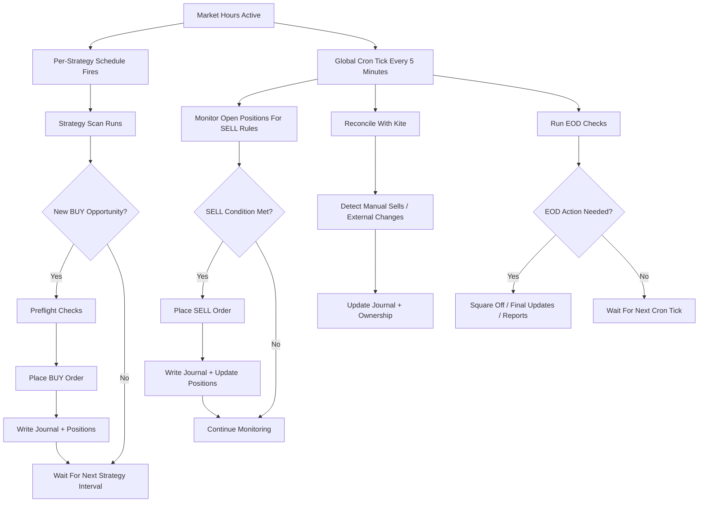

# Trading Engine Flow

This file explains the trading flow in simple English.

## Plain English Summary

- Strategy scan checks whether a strategy has a new BUY opportunity.
- Each strategy runs on its own configured interval.
- If a BUY qualifies, that strategy run can place the BUY immediately.
- The global cron tick runs every 5 minutes.
- The global cron tick monitors open positions for SELL conditions.
- The global cron tick also reconciles broker reality with the app state.
- End-of-day positive exits use estimated net P&L after charges, not just raw gross profit.
- Manual / outside-app closes are journaled and then removed from the live positions store so re-buys start with a fresh anchor.
- End-of-day actions are also handled by cron.

## Flowchart

## One-Line Understanding

- Strategy schedule is mainly for finding and placing BUYs.
- Global cron is mainly for SELL monitoring, reconciliation, and EOD housekeeping.
